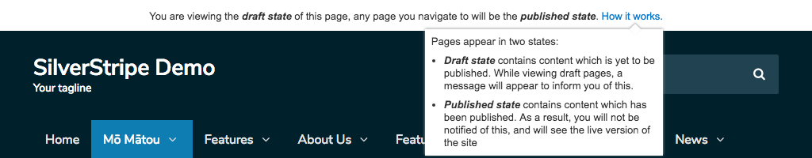

# Share draft content

The [Share draft content](https://github.com/silverstripe/silverstripe-sharedraftcontent/) module provides the ability for SilverStripe users to share draft page content with non-CMS users.

This enables CMS users to generate a private link which can be shared securely with anyone. Each preview link is valid for 30 days.

## Viewing the shared draft page

Navigating to the shared link will allow you to view the draft state of the page.

If you navigate away from the shared draft page you will be taken to the published state.

Pages appear in two states:
* Draft state contains content which is yet to be published. While viewing draft pages, a message will appear to inform you of this.
* Published state contains content which has been published. As a result, you will not be notified of this, and will see the live version of the site.

 <!-- to do update images when UI has been updated -->
